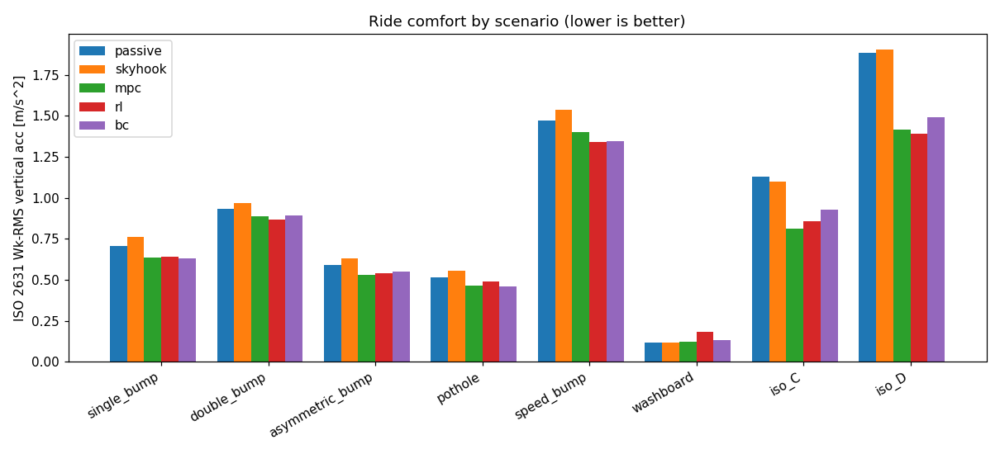
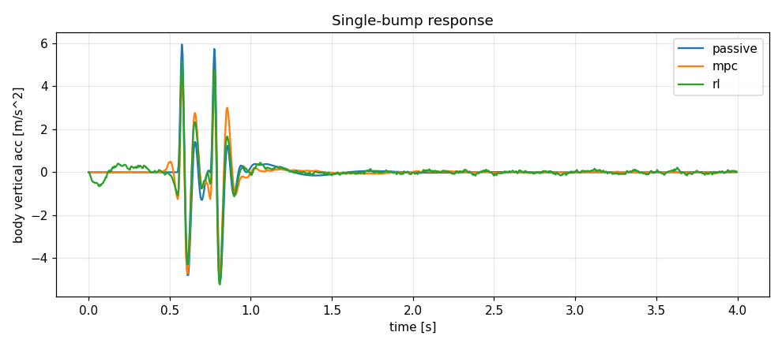
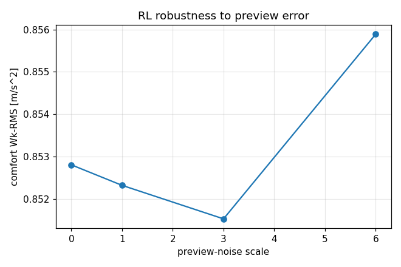
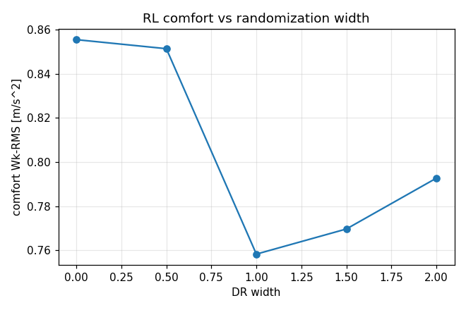

# Active Suspension - Validation Report

## Stage 1: Nominal comfort (Wk-RMS [m/s^2], lower is better)

| scenario | passive | skyhook | mpc | rl | bc | RL vs passive |
|---|---|---|---|---|---|---|
| single_bump | 0.705 | 0.760 | 0.638 | 0.639 | 0.632 | +9.3% |
| double_bump | 0.932 | 0.966 | 0.889 | 0.866 | 0.893 | +7.1% |
| asymmetric_bump | 0.588 | 0.629 | 0.530 | 0.540 | 0.548 | +8.1% |
| pothole | 0.517 | 0.554 | 0.462 | 0.487 | 0.458 | +5.7% |
| speed_bump | 1.473 | 1.539 | 1.399 | 1.338 | 1.345 | +9.2% |
| washboard | 0.117 | 0.117 | 0.121 | 0.182 | 0.132 | -55.8% |
| iso_C | 1.127 | 1.101 | 0.810 | 0.855 | 0.928 | +24.2% |
| iso_D | 1.886 | 1.904 | 1.414 | 1.390 | 1.493 | +26.3% |

## Stage 1b: Handling and constraints (nominal)

| scenario | ctrl | sws_max [m] | dtl_ratio_max | travel_viol |
|---|---|---|---|---|
| single_bump | passive | 0.0416 | 2.404 | 0 |
| single_bump | skyhook | 0.0416 | 2.405 | 0 |
| single_bump | mpc | 0.0529 | 2.774 | 0 |
| single_bump | rl | 0.0636 | 2.854 | 0 |
| single_bump | bc | 0.0522 | 2.820 | 0 |
| double_bump | passive | 0.0365 | 2.654 | 0 |
| double_bump | skyhook | 0.0385 | 2.447 | 0 |
| double_bump | mpc | 0.0526 | 2.800 | 0 |
| double_bump | rl | 0.0587 | 2.943 | 0 |
| double_bump | bc | 0.0507 | 2.909 | 0 |
| asymmetric_bump | passive | 0.0487 | 2.820 | 0 |
| asymmetric_bump | skyhook | 0.0487 | 2.825 | 0 |
| asymmetric_bump | mpc | 0.0607 | 3.066 | 0 |
| asymmetric_bump | rl | 0.0713 | 2.779 | 0 |
| asymmetric_bump | bc | 0.0597 | 2.731 | 0 |
| pothole | passive | 0.0304 | 2.048 | 0 |
| pothole | skyhook | 0.0304 | 2.049 | 0 |
| pothole | mpc | 0.0400 | 2.141 | 0 |
| pothole | rl | 0.0421 | 2.038 | 0 |
| pothole | bc | 0.0376 | 2.041 | 0 |
| speed_bump | passive | 0.0859 | 4.308 | 2 |
| speed_bump | skyhook | 0.0859 | 4.293 | 2 |
| speed_bump | mpc | 0.0954 | 4.816 | 7 |
| speed_bump | rl | 0.1025 | 4.882 | 8 |
| speed_bump | bc | 0.0945 | 4.685 | 7 |
| washboard | passive | 0.0044 | 0.846 | 0 |
| washboard | skyhook | 0.0044 | 0.846 | 0 |
| washboard | mpc | 0.0050 | 0.883 | 0 |
| washboard | rl | 0.0242 | 0.959 | 0 |
| washboard | bc | 0.0120 | 0.894 | 0 |
| iso_C | passive | 0.0370 | 1.550 | 0 |
| iso_C | skyhook | 0.0370 | 1.550 | 0 |
| iso_C | mpc | 0.0454 | 1.550 | 0 |
| iso_C | rl | 0.0433 | 1.550 | 0 |
| iso_C | bc | 0.0457 | 1.550 | 0 |
| iso_D | passive | 0.0568 | 2.768 | 0 |
| iso_D | skyhook | 0.0534 | 2.768 | 0 |
| iso_D | mpc | 0.0670 | 2.768 | 0 |
| iso_D | rl | 0.0615 | 2.768 | 0 |
| iso_D | bc | 0.0626 | 2.768 | 0 |

## Stage 2: Monte Carlo (domain-randomized) comfort mean +/- std

| scenario | passive | mpc | rl | bc |
|---|---|---|---|---|
| single_bump | 0.570+/-0.183 | 0.549+/-0.222 | 0.530+/-0.159 | 0.589+/-0.156 |
| double_bump | 0.610+/-0.319 | 0.593+/-0.355 | 0.589+/-0.301 | 0.601+/-0.307 |
| asymmetric_bump | 0.475+/-0.154 | 0.467+/-0.198 | 0.452+/-0.133 | 0.489+/-0.120 |
| pothole | 0.412+/-0.142 | 0.403+/-0.190 | 0.407+/-0.137 | 0.446+/-0.103 |
| speed_bump | 1.233+/-0.305 | 1.174+/-0.380 | 1.136+/-0.256 | 1.198+/-0.260 |
| washboard | 0.096+/-0.086 | 0.100+/-0.092 | 0.177+/-0.068 | 0.130+/-0.070 |
| iso_C | 1.382+/-0.167 | 0.999+/-0.081 | 1.049+/-0.067 | 1.100+/-0.024 |
| iso_D | 2.366+/-0.311 | 1.793+/-0.087 | 1.819+/-0.216 | 1.951+/-0.192 |

## Stage 3: Preview-error robustness (RL, iso_C)

| preview-noise scale | comfort Wk-RMS |
|---|---|
| 0.0x | 0.853+/-0.037 |
| 1.0x | 0.852+/-0.037 |
| 3.0x | 0.852+/-0.038 |
| 6.0x | 0.856+/-0.031 |

## Stage 4: Domain-randomization width sweep (RL, iso_C)

This addresses the open risk: too-narrow DR is fragile, too-wide is over-conservative.

| DR width | comfort Wk-RMS | mean travel violations |
|---|---|---|
| 0.0 | 0.856 | 0.0 |
| 0.5 | 0.851 | 0.0 |
| 1.0 | 0.758 | 0.0 |
| 1.5 | 0.770 | 0.0 |
| 2.0 | 0.793 | 0.0 |

## Stage 5: Command-level safety filter (harsh speed_bump, DR width 1.5)

| config | comfort | travel violations | interventions |
|---|---|---|---|
| safety_off | 0.978 | 0.0 | 0.0 |
| safety_on | 1.144 | 0.0 | 26.0 |

## Stage 6: Fallback supervisor decisions

| health condition | mode |
|---|---|
| healthy, good preview | rl |
| low preview confidence | rl_limited |
| compute overrun | skyhook |
| estimator fault | passive |
| state diverging | passive |

## Figures

